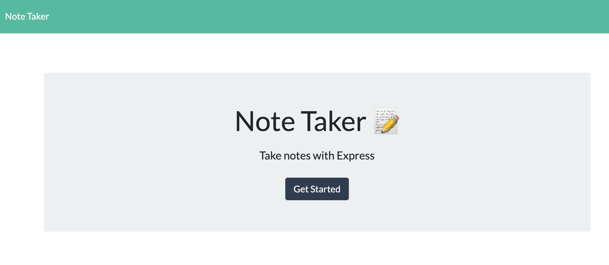
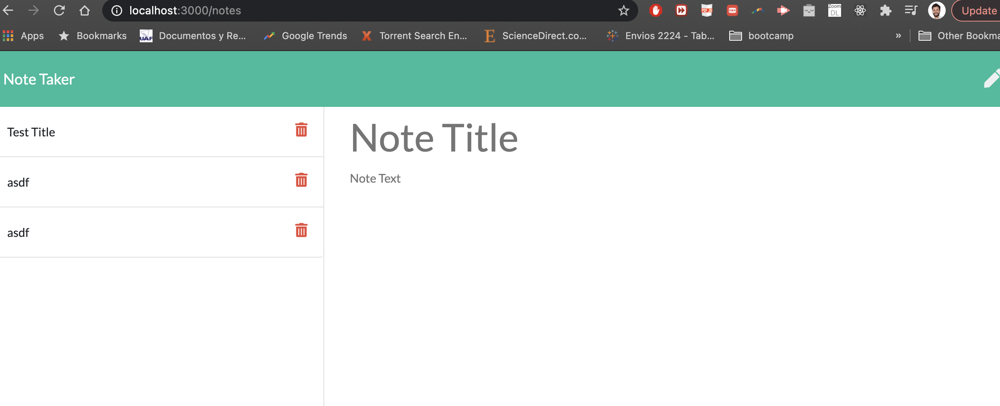

# noteTaker

## Table of Contents
1. [Description](#description)
2. [Installation Instructions](#installation-instructions)
3. [Usage](#usage)
4. [Contribution Guidelines](#contribution-guidelines)
5. [Test Instuctions](#test-instructions)
6. [License Information](#license-information)
7. [Questions](#questions)

## Description
This is an app made with express to take notes and display them to user.  Its simple to use. Still missing the delete functionality. Be sure to install all dependencies.

Demo Video: https://youtu.be/jVNl6N8nbQI

## Installation Instructions
run npm i from CLI

## Usage
npm start - to begin the server.

## License Information
### No license

## Questions
If you have further questions you can contact us at forteag328@gmail.com.

Github: fortega328

